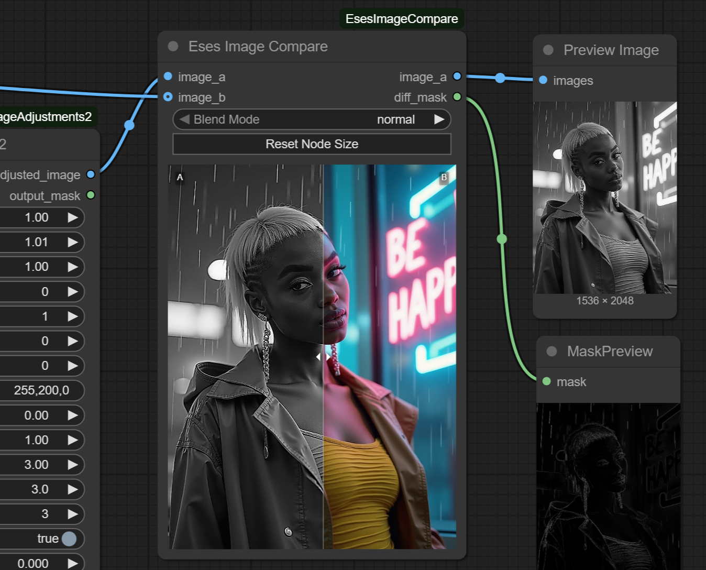

# Eses Image Compare




> [!CAUTION]
> Before downloading and using the contents of this repository, please review the LICENSE.txt and the disclaimer.
> I kindly ask that you respect the licensing terms and the effort put into these tools to ensure their 
> continued availability for everyone. Thank you!


## Description

* The 'Eses Image Compare' is a ComfyUI custom node designed for interactively viewing and comparing two images. 

* It provides a draggable slider to reveal one image over another, making it easy to spot differences.

* It includes a 'difference' and other blend modes for more detailed analysis (spot subtle changes in similar images). 

* It outputs a grayscale based difference mask, mostly for detecting image shape/pose/detail changes.

* It displays clear image `A` and image `B` labels - so no need to guess which image you see!

* Convenience - if single input is connected - no A/B slider is displayed.

* Node can be used either as a terminal viewer node, or inline within a workflow thanks to its optional image passthrough.

* 💡No other requirements than having ComfyUI installed.


## Features

* **Interactive Slider**: A draggable vertical line allows for precise comparison of two images.
* **Blend Modes**: A selectable blend mode to view differences between the two images.
* **Optional Passthrough**: Image A is passed through an output, allowing the node to be used in the middle of a workflow without breaking the chain. This passthrough is optional and won't cause errors if left unconnected.
* **Optional Diff Mask**: Grayscale / values based difference mask output for detecting image shape/pose/detail changes.
* **Clean UI**: The appearance of the slider and text labels has been refined for a clear and unobtrusive viewing experience. Slider stays on its place, even if you move the mouse cursor away from the node.


## Requirements

* PyTorch (included with a standard ComfyUI installation)


## Installation

1.  **Navigate to your ComfyUI custom nodes directory:**
    ```
    ComfyUI/custom_nodes/
    ```

2.  **Clone this repository:**
    ```
    git clone https://github.com/quasiblob/ComfyUI-EsesImageCompare.git
    ```

3.  **Restart ComfyUI:**
    * After restarting, the "Eses Image Compare" node will be available in the "Eses Nodes/Image Utilities" category.


## Folder Structure

```
ComfyUI-EsesImageCompare/
├── init.py              # Node registration.
├── image_compare.py     # Python logic for the node.
├── js/
│   └── image_compare.js # JavaScript for the custom UI and interactivity.
├── README.md            # This file.
├── LICENSE.txt          # You should read this file before using this node.
└── docs/                # Files related to this file.
```

## Usage

* Connect an image to the `image_a` input.
* Optionally, connect a second image to the `image_b` input for comparison.
* Use the mouse to drag the vertical slider left and right in the preview area.
* Toggle the "Difference Mode" to see a blend highlighting the changes between the images.
* If needed, connect the `image_a` output to the next node in the workflow.


## Category

Eses Nodes/Image Utilities


## Contributing

- Feel free to report bugs and improvement ideas in issues, but I may not have time to do anything.


## License

- See LICENSE.txt


## Update History

* **2026.2.9 Version 1.3.0** Added image dimensions display for image_a and image_b inputs, also works in single input mode.

* **2025.10.7 Version 1.2.2** Small fixes - fix sticky slider mouse drag

* **2025.8.15 Version 1.2.0** Added support for save input_a image, open input_a image and save workflow as json

* **2025.7.12 Version 1.1.0** Minor UI tweaks, disabled shadow effect

* **2025.7.12 Version 1.0.0** Initial public release


## ⚠️Disclaimer⚠️

This custom node for ComfyUI is provided "as is," without warranty of any kind, express or implied. By using this node, you agree that you are solely responsible for any outcomes or issues that may arise. Use at your own risk.


## Acknowledgements

Thanks to the ComfyUI team and community for their ongoing work!